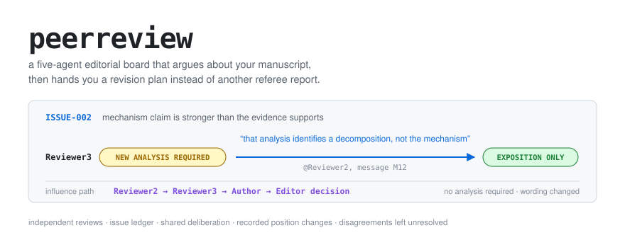
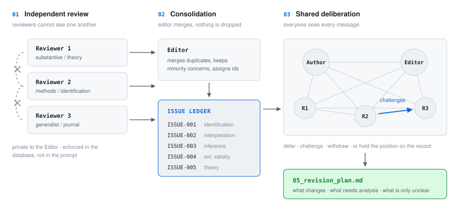

<p align="center">
  <picture>
    <source media="(prefers-color-scheme: dark)" srcset="docs/hero-dark.svg">
    
  </picture>
</p>

<p align="center">
  
  
  
  
  
</p>

<p align="center">
  <a href="#quickstart">Quickstart</a> ·
  <a href="#what-comes-out">What comes out</a> ·
  <a href="#how-it-works">How it works</a> ·
  <a href="#run-your-own-paper">Run your own paper</a> ·
  <a href="#designed-against-known-failure-modes">Failure modes</a> ·
  <a href="#tests">Tests</a>
</p>

---

Send a manuscript to a simulated editorial board: one **Author**, three **Reviewers**
(substantive, methods, generalist) and an **Editor** who chairs the discussion and keeps a
canonical issue ledger. The reviewers judge the paper alone first, then everyone argues in a
shared room where they can challenge each other, defer to the reviewer with the relevant
expertise, withdraw an objection, or put a disagreement on the record and leave it there.

What you get back is an **operational revision plan**: what substantively needs to change, what
new analysis is actually required, what only needs saying more clearly, which objections were
withdrawn after rebuttal, and what nobody agreed on.

## Quickstart

```bash
git clone https://github.com/matthewdigiuseppe/RnR-agent-panel && cd RnR-agent-panel
pip install -e .
peerreview demo          # a complete deliberation, no API key, no cost
```

The demo ships with a short manuscript on austerity and incumbent support, and a deterministic
scripted panel, so you can see the whole machine work before spending a token:

```
=== Phase 1: independent reviews (reviewers cannot see each other) ===
  Reviewer1 -> Editor (37w)          Reviewer1 raised 2 issue(s)
  Reviewer2 -> Editor (29w)          Reviewer2 raised 2 issue(s)
  Reviewer3 -> Editor (20w)          Reviewer3 raised 2 issue(s)

=== Phase 2: issue consolidation ===
  issue_created ISSUE-002: Mechanism claim is stronger than the evidence supports
  merge ISSUE-002: absorbed R1-01
  merge ISSUE-002: absorbed R3-01
  canonical ledger: 5 issue(s)

=== Phase 3: shared deliberation ===
  disclosed 3 independent review(s) to all participants

[Round 2]
  Editor opens ISSUE-002
  Reviewer3 -> Reviewer2 [ISSUE-002] (84w)
  Reviewer3 changes position on ISSUE-002:
    OBJECTION (MODERATE) -> EXPOSITION ONLY  (triggered by M12 Reviewer2)
  Editor updates ISSUE-002: OPEN -> EXPOSITION ONLY
  Editor updates ISSUE-003: OPEN -> NEW ANALYSIS REQUIRED
  Editor updates ISSUE-004: OPEN -> UNRESOLVED DISAGREEMENT

=== Deliberation ended: all issues reached terminal statuses ===
```

## What comes out

Every issue lands in `05_revision_plan.md` with an action specific enough to act on:

```markdown
### ISSUE-003 — Fourteen subgroup tests reported without multiplicity adjustment

PRIORITY: essential            FINAL CLASSIFICATION: new analysis
STATUS: NEW ANALYSIS REQUIRED  RAISED BY: Reviewer2

EXACT REQUIRED ACTION:
Report Romano-Wolf stepdown adjusted p-values for all fourteen splits in Appendix A5
and the adjusted p-value for the public-employment split in Section 5; state that the
split was specified in a design note that is not a public registration. If the adjusted
p-value exceeds 0.05, rewrite the heterogeneity discussion as suggestive.

ANALYSIS REQUIRED: yes
  Exact analysis: Romano-Wolf stepdown adjusted p-values for all fourteen heterogeneity
  splits, using 10,000 bootstrap replications clustered at the municipality level.

EDITOR DECISION: Required, not optional. The mechanism discussion rests on this split.
```

And because every position change has to name the message that caused it, `07_influence_report.md`
can reconstruct who moved whom:

```
ISSUE-002: Mechanism claim is stronger than the evidence supports
  Round 1: Reviewer3 asked for a mediation analysis.
  Round 2: Reviewer2 argued it would identify a decomposition under untestable
           sequential ignorability, not the mechanism.
  Round 2: Reviewer3 moved OBJECTION -> EXPOSITION ONLY (after M12), keeping the
           concern that the qualification must reach the abstract.
  Author narrowed the claim; Editor classified it EXPOSITION ONLY.

  Influence path:  Reviewer2 -> Reviewer3 -> Author -> Editor decision
```

Nobody was talked into consensus. `ISSUE-004` ended as `UNRESOLVED DISAGREEMENT`, with both
positions recorded, because the disagreement was real.

## How it works

<p align="center">
  <picture>
    <source media="(prefers-color-scheme: dark)" srcset="docs/pipeline-dark.svg">
    
  </picture>
</p>

**Independence is enforced in the database, not in the prompt.** A message is visible to an agent
only if it sent it, received it, is shared, or was explicitly disclosed at a round. Phase-1 reviews
are private to the Editor; opening the shared room records `disclosed_at_round = 1` rather than
rewriting anything, so replaying the run at round 0 still shows the reviews as unseen. That is what
makes the anti-herding claim testable instead of aspirational.

**Influence links are validated, not trusted.** A model cannot know message ids as it writes, so
`TRIGGERED BY: @Reviewer2` resolves to that agent's most recent message on the issue. A trigger
that resolves to nothing is dropped rather than invented, and the tests assert that no dangling
link survives.

**Editor slips are caught mechanically.** A reviewer issue the Editor forgets to consolidate is
auto-linked to its nearest canonical issue, or carried forward as its own. A minority concern
cannot vanish through inattention.

## Run your own paper

```bash
peerreview init austerity-paper && cd austerity-paper
cp ~/papers/manuscript.pdf papers/
cp ~/papers/appendix.pdf papers/
$EDITOR peerreview.yaml            # paths, journal, models

export ANTHROPIC_API_KEY=...       # and/or OPENAI_API_KEY

peerreview run . --dry-run         # check parsing, sections and agents: no model calls
peerreview run . -v
```

Roughly 30–60 model calls for a paper with 12–15 issues. `Ctrl-C` is safe at any point: SQLite is
the canonical state and `peerreview resume .` picks up at the next round.

| Command | |
|---|---|
| `peerreview run .` | the deliberation, start to finish |
| `peerreview status .` | where a run stands, issue counts, position changes |
| `peerreview issues . --open` | the live ledger |
| `peerreview transcript . --issue ISSUE-003` | everything said about one issue |
| `peerreview intervene . --message "..."` | step in as the real author, editor or reviewer |
| `peerreview resume .` | continue after an interruption |
| `peerreview export .` | (re)write the outputs |

### Outputs

```
runs/2026-09-18-austerity-paper/
```

| File | |
|---|---|
| `01_initial_reviews.md` | the three reviews, as written before any contact |
| `02_issue_ledger_initial.md` | the ledger as it stood when deliberation opened |
| `03_deliberation_transcript.md` | every message, with the ids agents cite |
| `04_issue_ledger_final.md` | final statuses, positions, editor decisions |
| **`05_revision_plan.md`** | **the deliverable** |
| `06_unresolved_disagreements.md` | what the panel did not settle, and why |
| `07_influence_report.md` | who changed whose mind |
| `08_machine_readable_results.json` | all of the above, structured |
| `09_revised_manuscript.md` | optional stage, with a per-issue change log |
| `10_response_to_reviewers.md` | optional stage |

### Stepping in

You can intervene at any round boundary; human input is stored separately from agent messages and
nothing is ever overwritten.

```bash
peerreview intervene . --pause
peerreview intervene . --message "The event study is in Appendix A1." --as Author --issue ISSUE-001
peerreview intervene . --correction --message "Reviewer3 misread Table 3: it is a tercile split."
peerreview intervene . --reopen ISSUE-004 --reason "New data the panel has not seen."
peerreview intervene . --focus ISSUE-002,ISSUE-003
peerreview resume .
```

## Designed against known failure modes

| Failure mode | Mitigation |
|---|---|
| **Herding** | Phase-1 independence enforced by the visibility layer, not by prompting |
| **Sycophancy** | Disagreement is explicitly legitimate; `UNRESOLVED DISAGREEMENT` is a terminal state |
| **Endless discussion** | Terminal statuses, editor control, stability and max-round stopping |
| **Repetition** | Full transcript in context, instruction not to restate, settled issues collapsed to one-line summaries |
| **Context explosion** | Relevant manuscript sections + focused issue history + recent messages, under a token budget |
| **Hallucination** | Required manuscript locations; "the manuscript says X" / "I infer X" / "I recommend X"; uncited criticisms flagged |
| **Fake consensus** | The Editor may not close an issue to tidy the ledger; positions are recorded per agent, never collectively |

<details>
<summary><b>Configuration</b> — any agent can use any provider</summary>

`peerreview.yaml` (TOML works too):

```yaml
project:
  manuscript: papers/manuscript.pdf
  appendix: papers/appendix.pdf
  journal: British Journal of Political Science

deliberation:
  max_rounds: 20
  stable_rounds_before_stop: 2        # stop after N rounds with no position change
  intervention_word_limit: 350
  max_agenda_per_round: 3

execution:
  isolation: thread                   # serial | thread | process

context:
  max_prompt_tokens: 60000
  recent_messages: 14

defaults:
  provider: anthropic
  model: claude-sonnet-5

agents:
  author:    {provider: anthropic, model: claude-opus-5}
  reviewer1: {specialization: substantive}
  reviewer2: {specialization: methods, provider: anthropic, model: claude-opus-5}
  reviewer3: {specialization: generalist, provider: openai, model: gpt-4o}
  editor:    {provider: anthropic, model: claude-sonnet-5}

revision_stage:
  enabled: false                      # 09_revised_manuscript.md + 10_response_to_reviewers.md
```

Reviewer expertise and prompts are overridable per agent with `expertise:`, `system_prompt:` or
`system_prompt_file:`.

</details>

<details>
<summary><b>Providers</b> — anthropic, openai, local <code>claude</code> CLI, or your own</summary>

Orchestration never imports a provider SDK. `claude_cli` shells out to a local authenticated
Claude Code install and needs no API key; `mock` is deterministic and free, and drives the whole
test suite. Adding a provider means implementing one method:

```python
from peerreview.backends import AgentBackend, BackendResponse, register_backend

class MyBackend(AgentBackend):
    provider = "mine"

    def _send(self, messages, system_prompt, tools):
        ...
        return BackendResponse(text=..., provider=self.provider, model=self.model)

register_backend("mine", MyBackend)
```

Backends must be reconstructible from `to_config()`, which is what lets `isolation: process` run
each agent turn in a separate OS process.

</details>

<details>
<summary><b>Architecture</b></summary>

```
peerreview/
  schema.sql      runs · agents · messages · issues · issue_positions
                  issue_events · llm_calls · interventions
  db.py           the only place visibility and reopen rules are enforced
  manuscript.py   md/pdf → sections, page numbers, table/figure anchors, retrieval
  backends/       AgentBackend + anthropic / openai / claude_cli / mock
  agents.py       isolated agent runtimes; serial, thread or process execution
  context.py      token-budgeted context assembly
  prompts.py      role prompts and per-phase instructions
  parsing.py      ISSUE · POSITION CHANGE · AGENDA · LEDGER UPDATE · MERGE · REVISION
  ledger.py       applies editor moves; records position changes and their triggers
  orchestrator.py phases, rounds, termination
  influence.py    influence edges, paths and aggregates
  exports.py      the eight outputs
  revision.py     optional stages 09 and 10
  cli.py          init · run · resume · status · issues · transcript · export · intervene · demo
```

SQLite is the canonical state: complete prompts, model names and parameters, tool calls, every
message, manuscript hashes, configuration and run id are all persisted, so runs are reproducible
and resumable rather than living in ephemeral context.

</details>

## Tests

```bash
pip install -e '.[dev]'
python -m pytest            # 77 tests, deterministic mock models, no API calls
```

Covering phase-1 invisibility, full disclosure at phase 3, reviewer-to-reviewer exchange, merges
preserving original comments, position-change logging, influence links resolving to real messages,
reopen-requires-a-reason, resume after interruption, human interventions, terminal statuses and
stopping rules, provider swappability, and the revision plan containing every non-dismissed issue.

`examples/demo/make_mock_script.py` shows how to script a whole deliberation deterministically:
rules match on the prompt header (`AGENT:`, `PHASE:`, `ROUND:`, `ISSUES ON THE TABLE:`), so
orchestration changes can be tested for free.

## Status

v0.1.0, alpha. Known limits worth knowing before you point it at something important:

- **PDF extraction is best-effort.** The fallback chain is pypdf → pdfminer.six → PyMuPDF →
  poppler's `pdftotext`; section splitting is tuned for numbered and conventional social-science
  headings. Run `--dry-run` first and look at the outline before spending calls. Markdown input is
  exercised much more heavily.
- **Resumption is round-level.** Interrupting mid-round replays that round's turns.
- **Deliberation quality tracks model quality.** The scaffolding enforces structure, records
  positions and refuses to manufacture consensus; it cannot make a weak reviewer model say
  something insightful.
